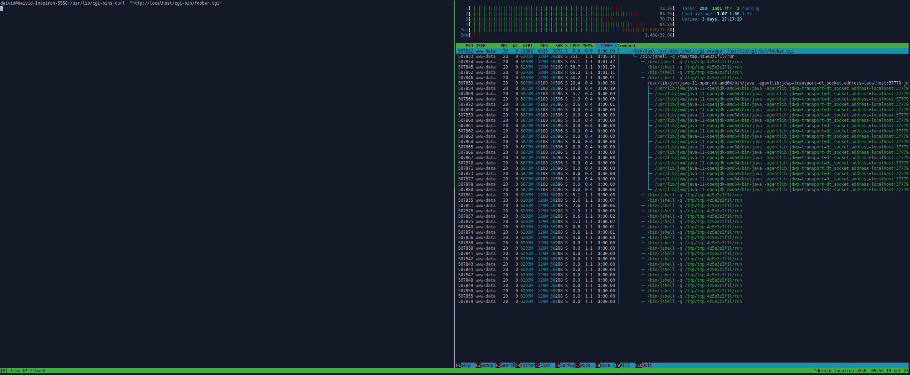
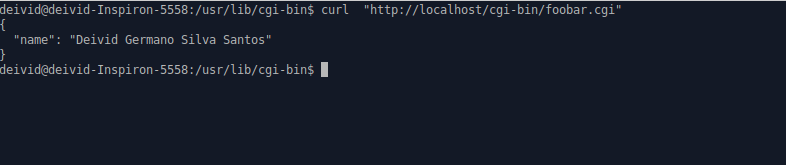

# jshell-cgi-wrapper

A CGI (Common Gateway Interface) wrapper for executing Java code using JShell via a web interface.

## Table of Contents

- [Description](#description)
- [Features](#features)
- [Prerequisites](#prerequisites)
- [Installation](#installation)
- [Print Screen of Usage](#printusage)


## Description

The `jshell-cgi-wrapper` is a tool that allows users to run Java code snippets through a web interface using JShell, a Java REPL (Read-Eval-Print Loop). 

For more information about the development, you can refer to the following resources:

- [Gist: jshell-cgi-wrapper Development](https://gist.github.com/ffissore/012d7e32a096fde5266f49038c93dcaf): This Gist provides a wrapper to use jshell in terminal.

- [TechExpert.tips: Nginx Shell Script CGI](https://techexpert.tips/nginx/nginx-shell-script-cgi/): This web page contains a tutorial and examples related to setting up CGI scripting with Nginx, which can be useful for hosting this project.


## Features

- Execute Java code snippets in an interactive web interface.
- Utilizes the power of JShell for real-time evaluation.
- Provides a simple CGI-based web interface for code execution.

## Prerequisites

Before using `jshell-cgi-wrapper`, ensure you have the following prerequisites:

- A web server with CGI support (e.g., Apache, Nginx).
- A Java Development Kit (JDK) installed on the server.
- CGI scripting enabled on your web server.

## Installation

1. Clone this repository to your web server:

   ```bash
   git clone https://github.com/deividgermano/jshell-cgi-wrapper.git
   cd jshell-cgi-wrapper
   mv jshell-cgi-wrapper /usr/bin
   chmod +x /usr/bin/jshell-cgi-wrapper
   chmod +x foobar.cgi
   ./foobar.cg
   ```
   
2. Configure your web server to enable CGI scripting for the cgi-bin directory.

## Print Screen of Usage




